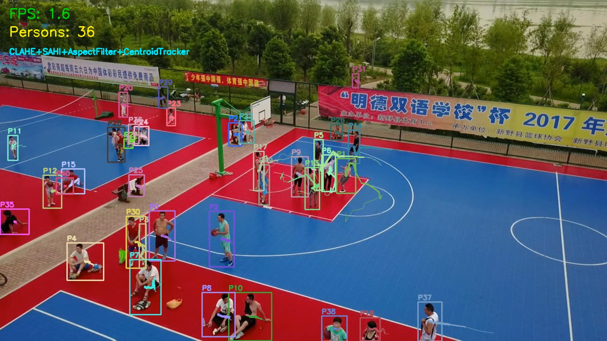

## Project: **The Aerial Guardian**

#### This project aims to: 
 1. **Detection:** Implement YOLO detector optimized for small-scale
    objects.
 2. **Tracking:** Implement the Multi-Object Tracking (MOT) ByteTrack algorithm, this attempts to maintain consistent IDs despite drone
       movement.




#### **Dataset**: 
VisDrone dataset is the MOT of VisDrone Dataset : https://github.com/VisDrone/VisDrone-Dataset?tab=readme-ov-file

## Pipeline

CLAHE → SAHI Tiling → YOLOv8s → Aspect Filter → NMS → Centroid Tracker → Tails

------------------------------------------------------

#### Folder Structure

```
aerial_guardian/
├── dataset/
│   └── VisDrone-MOT-val/
├── models/
├── output/
│   └── output_tracked.mp4
├── scripts/
└── README.md
└── Report.pdf
```
------------------------------------------------

### Steps to run: 
1. Clone the repository
```bash
git clone https://github.com/mohitk3000/aerial_guardian.git
```
2. Navigate to the cloned directory
```bash
cd aerial_guardian
```
3. Create a virtual env for python: 
```bash
python3 -m venv visdrone_env
```
4. Activate the virtual env:
```bash
source visdrone_env/bin/activate
```
5. install PyTorch first (needs special URL)
```bash
pip install torch torchvision torchaudio --index-url https://download.pytorch.org/whl/cu118
```
6. install everything else from file
```bash
pip install -r requirements.txt
```
7. Navigate to the `scripts` directory
```bash
cd scripts
```
8. run the script
```bash
python3 tracking.py
```
```bash
python3 tracking_batch.py
```
9. To run on Multiple Sequences: 
```bash
python3 sequnce_tracking.py
```
10. To run on tracking with KF: 
```bash
python3 tracking_KF.py
```

------------------------------------------------------


### Output File Reference: 
1. Without batch: [output_tracked](https://youtu.be/d2hRnKUAwr0)
2. With batch: [output_tracked_batch](https://youtu.be/gl6cCRZVUJo)
3. multiple Sequence: [sequece_tracking](https://www.youtube.com/playlist?list=PLeqdOBL8gK12IaTHL6xiGu-Oqc-bRsfG4)
4. tracking with KF: [tracking_KF](https://youtu.be/q9qCARBuMjA)

| Metric | tracking.py | tracking_batch.py |
|---|---|---|
| Processing Mode | Sequential (frame-by-frame) | Batch processing |
| Batch Size | N/A | 4 frames |
| Average FPS | 2.52 | 2.38 |
| Instantaneous FPS Range | 0.6 - 1.5 | 1.1 - 1.6 |

--------------------------------------------------------------- 

## Results
| Metric        | Value                        |
|---------------|------------------------------|
| FPS           | ~2.0 (SAHI) |
| Hardware      | NVIDIA GTX 1050 Ti (4GB)     |
| Model size    | 22MB (YOLOv8s)               |
| Persons/frame | 30-56 detected               |

---------------------------------------------------------------


### Technical Report: 
For detalied report refer this document [Report.pdf](./Report.pdf)

------------------------------------------

### Hardware: 
**NVIDIA GeForce GTX 1050 Ti (4GB VRAM)**

Since this is intended for a drone, so **FPS** of pipeline and the **hardware** used for the test are most critical.

------------------------------------------------------
### Models Tried: 

1. yolo8n
2. yolo8s
3. custom: trained on visdrone_dataset
- https://huggingface.co/mshamrai/yolov8s-visdrone
-  https://github.com/xuanandsix/VisDrone-yolov8?tab=readme-ov-file